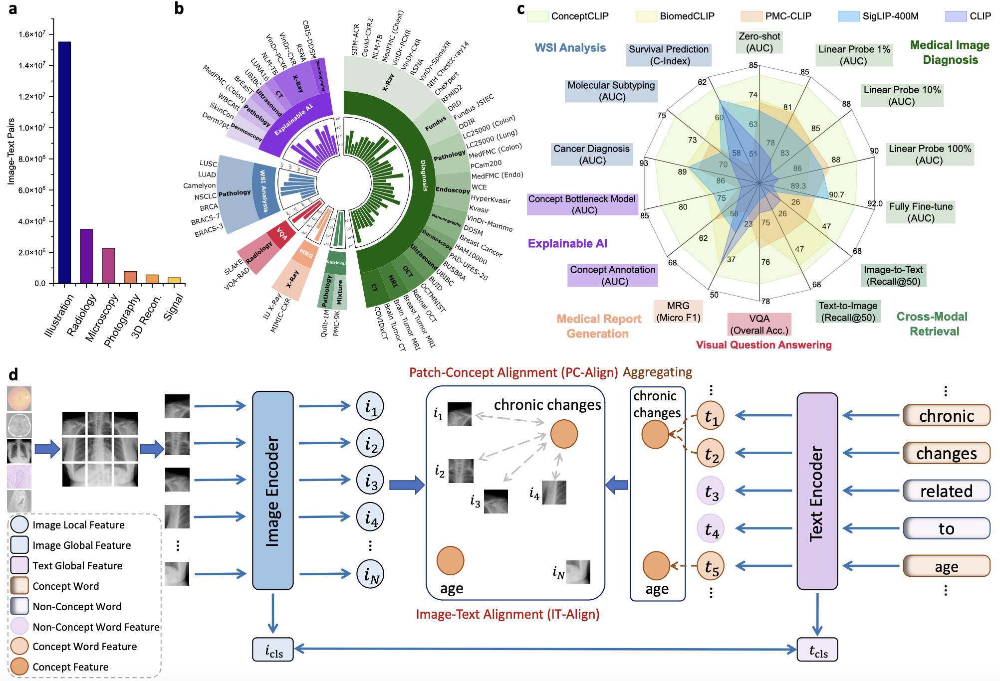

# ConceptCLIP: Towards Trustworthy Medical AI via Concept-Enhanced Contrastive Language-Image Pre-training
ConceptCLIP is a large-scale, pre-training vision-language model designed for diverse medical image modalities.

[🤗Model on Hugging Face](https://huggingface.co/JerrryNie/ConceptCLIP) 

## Overview
<div style="text-align: center;">
    
</div>

**ConceptCLIP** enhances language-image pre-training with medical concepts, enabling it to handle various image modalities across multiple tasks.

**Authors:** Yuxiang Nie*, Sunan He*, Yequan Bie*, Yihui Wang, Zhixuan Chen, Shu Yang, Hao Chen**
(*Equal Contribution, **Corresponding author)

## News
- [01/25]🔥We released ConceptCLIP, a pre-training model for medical vision-language tasks with concept enhancements. Explore our [paper](https://arxiv.org/abs/2501.15579) and [model](https://huggingface.co/JerrryNie/ConceptCLIP).

## Environment
ConceptCLIP is built on [OpenCLIP](https://github.com/mlfoundations/open_clip). Follow the [requirements.txt](https://github.com/mlfoundations/open_clip/blob/main/requirements.txt) to set up your environment.

## Usage
ConceptCLIP is integrated with Hugging Face, making it easy to load and use in Python.
```python
from transformers import AutoModel, AutoProcessor
import torch
from PIL import Image

# Load model and processor
model_name = 'JerrryNie/ConceptCLIP'
model = AutoModel.from_pretrained(model_name, trust_remote_code=True)
processor = AutoProcessor.from_pretrained(model_name, trust_remote_code=True)

# Define a single image and a few labels
image = Image.open('example_data/chest_X-ray.jpg').convert('RGB')
labels = ['chest X-ray', 'brain MRI', 'pie chart']

# Process inputs
inputs = processor(images=image, text=['a medical image of ' + label for label in labels], return_tensors='pt', padding=True, truncation=True).to(model.device)

# Perform inference
with torch.no_grad():
    outputs = model(image=inputs['pixel_values'], text=inputs['input_ids'])
    logits = (outputs['logit_scale'] * outputs['image_features'] @ outputs['text_features'].t()).softmax(dim=-1)[0]

# Print results
print({label: logits[i].item() for i, label in enumerate(labels)})
```
For more detailed usage, refer to `usage.py`.

## Acknowledgement
This project is based on [OpenCLIP](https://github.com/mlfoundations/open_clip). We appreciate the authors for their open-source contributions and encourage users to cite their works when applicable.

## Citation
If you use this code for your research or project, please cite:
```bib
@article{nie2025conceptclip,
  title={{ConceptCLIP: Towards Trustworthy Medical AI via Concept-Enhanced Contrastive Language-Image Pre-training}},
  author={Nie, Yuxiang and He, Sunan and Bie, Yequan and Wang, Yihui and Chen, Zhixuan and Yang, Shu and Chen, Hao},
  journal={arXiv preprint arXiv:2501.15579},
  year={2025}
}
```
## Contact
For any questions, please contact Yuxiang Nie at ynieae@connect.ust.hk.
