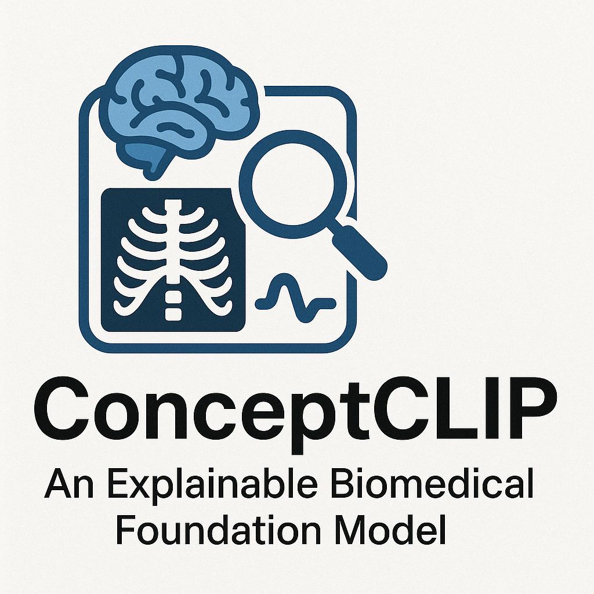

# ConceptCLIP: An Explainable Biomedical Foundation Model via Large-Scale Concept-Enhanced Vision-Language Pre-training

[🤗Model on Hugging Face](https://huggingface.co/JerrryNie/ConceptCLIP) 

<div align="center">
  
</div>

## Overview

**ConceptCLIP** is an explainable biomedical foundation model that enhances vision-language pre-training with medical concepts. The model can:
- Process multiple medical image types (X-rays, MRIs, pathology slides, etc.)
- Provide explainable results through medical concept annotation and interpretable model
- Support various downstream tasks like diagnosis, retrieval, and question answering

**Authors:** Yuxiang Nie*, Sunan He*, Yequan Bie*, Yihui Wang, Zhixuan Chen, Shu Yang, Zhiyuan Cai, Hongmei Wang, Xi Wang, Luyang Luo, Mingxiang Wu, Xian Wu, Ronald Cheong Kin Chan, Yuk Ming Lau, Yefeng Zheng, Pranav Rajpurkar, Hao Chen**
(*Equal Contribution, **Corresponding author)

## News
- [01/25]🔥We released ConceptCLIP, a pre-training model for medical vision-language tasks with concept enhancements. Explore our [paper](https://arxiv.org/abs/2501.15579) and [model](https://huggingface.co/JerrryNie/ConceptCLIP).

## Environment
ConceptCLIP is built on [OpenCLIP](https://github.com/mlfoundations/open_clip). Follow the [requirements.txt](https://github.com/mlfoundations/open_clip/blob/main/requirements.txt) to set up your environment.

## Usage
ConceptCLIP is integrated with Hugging Face, making it easy to load and use in Python.
```python
from transformers import AutoModel, AutoProcessor
import torch
from PIL import Image

model = AutoModel.from_pretrained('JerrryNie/ConceptCLIP', trust_remote_code=True)
processor = AutoProcessor.from_pretrained('JerrryNie/ConceptCLIP', trust_remote_code=True)

image = Image.open('example_data/chest_X-ray.jpg').convert('RGB')
labels = ['chest X-ray', 'brain MRI', 'skin lesion']
texts = [f'a medical image of {label}' for label in labels]

inputs = processor(
    images=image, 
    text=texts,
    return_tensors='pt',
    padding=True,
    truncation=True
).to(model.device)

with torch.no_grad():
    outputs = model(**inputs)
    logits = (outputs['logit_scale'] * outputs['image_features'] @ outputs['text_features'].t()).softmax(dim=-1)[0]

print({label: f"{prob:.2%}" for label, prob in zip(labels, logits)})
```
For more detailed usage, refer to `usage.py`.

## Acknowledgement
This project is based on [OpenCLIP](https://github.com/mlfoundations/open_clip). We appreciate the authors for their open-source contributions and encourage users to cite their works when applicable.

## Citation
If you use this code for your research or project, please cite:
```bib
@article{nie2025conceptclip,
  title={{An Explainable Biomedical Foundation Model via Large-Scale Concept-Enhanced Vision-Language Pre-training}},
  author={Nie, Yuxiang and He, Sunan and Bie, Yequan and Wang, Yihui and Chen, Zhixuan and Yang, Shu and Cai, Zhiyuan and Wang, Hongmei and Wang, Xi and Luo, Luyang and Wu, Mingxiang and Wu, Xian and Chan, Ronald Cheong Kin and Lau, Yuk Ming and Zheng, Yefeng and Rajpurkar, Pranav and Chen, Hao},
  journal={arXiv preprint arXiv:2501.15579},
  year={2025}
}
```
## Contact
For any questions, please contact Yuxiang Nie at ynieae@connect.ust.hk.
