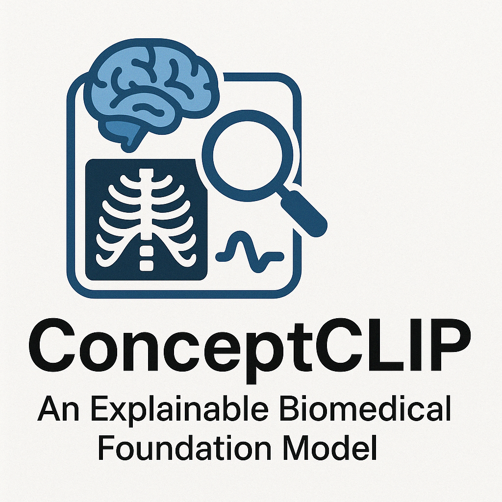

# ConceptCLIP: An Explainable Biomedical Foundation Model via Large-Scale Concept-Enhanced Vision-Language Pre-training

<div align="center">
  
</div>

## Overview

**ConceptCLIP** is an explainable biomedical foundation model that enhances vision-language pre-training with medical concepts. The model can:
- Process multiple medical image types (X-rays, MRIs, pathology slides, etc.)
- Provide explainable results through medical concept annotation and interpretable model
- Support various downstream tasks like diagnosis, retrieval, and question answering

## Quick Start

### Installation

```bash
# Download the repository
cd ConceptCLIP_Full

# Install requirements
pip install -r requirements.txt
```

### Access Pre-trained Model from Hugging Face

ConceptCLIP is available on Hugging Face as `JerrryNie/ConceptCLIP`.

> **Note**
> The Hugging Face repository uses gated access. Please request access on the model page first, then load the model directly with `transformers`.

### Using Pre-trained Model

```python
from transformers import AutoModel, AutoProcessor
import torch
from PIL import Image

# Load model and processor directly from Hugging Face
model = AutoModel.from_pretrained("JerrryNie/ConceptCLIP", trust_remote_code=True)
processor = AutoProcessor.from_pretrained("JerrryNie/ConceptCLIP", trust_remote_code=True)

# Prepare inputs
image = Image.open("example_data/chest_X-ray.jpg").convert("RGB")
labels = ["chest X-ray", "brain MRI", "skin lesion"]
texts = [f"a medical image of {label}" for label in labels]

# Process inputs
inputs = processor(
    images=image,
    text=texts,
    return_tensors="pt",
    padding=True,
    truncation=True
).to(model.device)

# Get predictions
with torch.no_grad():
    outputs = model(**inputs)
    logits = (
        outputs["logit_scale"]
        * outputs["image_features"]
        @ outputs["text_features"].t()
    ).softmax(dim=-1)[0]

print({label: f"{prob:.2%}" for label, prob in zip(labels, logits)})
```

## Datasets

The following datasets are used as examples in our evaluations:

| Task | Dataset | Download Link |
|------|---------|--------------|
| Medical Diagnosis | [SIIM-ACR](https://www.kaggle.com/c/siim-acr-pneumothorax-segmentation) | [Download](https://hkustconnect-my.sharepoint.com/:u:/g/personal/ynieae_connect_ust_hk/Ect9muVKw85PpJSDga-JNnUBGeDx4Cjs6ior8Gk0itwZpQ?e=JbKPmk) |
| Cross-Modal Retrieval | [QUILT-1M](https://quilt1m.github.io/) | [Download](https://hkustconnect-my.sharepoint.com/:u:/g/personal/ynieae_connect_ust_hk/Ed09CqyaQ5hMsqeJv318lOgBF7rRF8Pg0cgLRG6OdwOH4A?e=ksLxVs) |
| Cross-Modal Retrieval | [PMC-9K](https://huggingface.co/datasets/JerrryNie/pmc9k) | [Download](https://huggingface.co/datasets/JerrryNie/pmc9k) |
| Visual Question Answering | [SLAKE](https://www.med-vqa.com/slake/) | [Download](https://hkustconnect-my.sharepoint.com/:u:/g/personal/ynieae_connect_ust_hk/ESemI-UyVURGnb5i6YddAm8BWf7PLqxQnao95uiaB81f9w?e=hyFOzR) |
| Medical Report Generation | [IU X-Ray](https://www.kaggle.com/datasets/raddar/chest-xrays-indiana-university) | [Download](https://www.kaggle.com/datasets/raddar/chest-xrays-indiana-university/data) |
| Pathology WSI Analysis | [BRACS-3](https://www.bracs.icar.cnr.it/) | [Download](https://www.bracs.icar.cnr.it/) |
| Medical Concept Annotation | [Derm7pt](https://derm.cs.sfu.ca/) | [Download](https://derm.cs.sfu.ca/Download.html) |
| Inherently Interpretable Model | [WBCAtt](https://github.com/apple2373/wbcatt) | [Download](https://data.mendeley.com/datasets/snkd93bnjr/1) |

After downloading, extract the datasets to their respective directories as mentioned in each task section below.

## Downstream Tasks

### 1. Medical Image Diagnosis

Using SIIM-ACR pneumothorax dataset (requires one GPU with 24GB memory):

```bash
# Extract the downloaded dataset to this directory
# ./downstream_evaluation/medical_image_diagnosis/data/images

# Zero-shot evaluation
cd downstream_evaluation/medical_image_diagnosis
python zero_shot.py

# Linear probing
python linear_probing.py

# Full fine-tuning
./fully_fine_tuning.sh
```

### 2. Cross-Modal Retrieval

ConceptCLIP supports cross-modal retrieval evaluation on both **QUILT-1M** and **PMC-9K**.

#### Option A: QUILT-1M

Using QUILT-1M dataset (requires one GPU with 24GB memory):

```bash
# Extract the downloaded dataset to this directory
# ./downstream_evaluation/cross_modal_retrieval/data/images/002_Quilt1M

cd downstream_evaluation/cross_modal_retrieval
python retrieval.py
````

#### Option B: PMC-9K

PMC-9K is also available as a retrieval benchmark on Hugging Face.

```python
from datasets import load_dataset
dataset = load_dataset("JerrryNie/pmc9k")
print(dataset)
```

> **Important**
> The Hugging Face repository mainly provides metadata and benchmark artifacts, rather than a ready-to-use fully reconstructed image-text paired dataset.
>
> To build the complete image-text paired dataset for retrieval evaluation, you should follow a reconstruction workflow similar to the pre-training data pipeline: use the released metadata to locate or recover the corresponding upstream images, then organize the image-text pairs into the format expected by the evaluation code.

After preparing the dataset, place it under the directory expected by the retrieval pipeline and run:

```bash
cd downstream_evaluation/cross_modal_retrieval
python retrieval.py
```

### 3. Visual Question Answering

Using SLAKE dataset (requires one GPU with 24GB memory):

```bash
# Extract the downloaded dataset to this directory
# ./downstream_evaluation/visual_question_answering/data

cd downstream_evaluation/visual_question_answering
./train_slake_conceptclip.sh
```

### 4. Other Tasks

For the following tasks, refer to their respective README files for detailed instructions:

- **Medical Report Generation**: [README](./downstream_evaluation/medical_report_generation/README.md)
- **Pathology WSI Analysis**: [README](./downstream_evaluation/pathology_whole_slide_image_analysis/README.md)
- **Medical Concept Annotation**: [README](./downstream_evaluation/medical_concept_annotation/README.md)
- **Interpretable Model**: [README](./downstream_evaluation/inherently_interpretable_model/README.md)

## Pre-training Details

To train ConceptCLIP from scratch (requires 6 nodes × 8 H800 GPUs), you must first download the full metadata, fetch the original images, and prepare the data for efficient loading.

### 1\. Data Preparation

**Step A: Download Full Metadata**
We provide the full metadata (**MedConcept-23M**, \~44.9 GB) containing 23 million (image-path, text, and concept) triplets on Hugging Face. Download it to your data directory:

```bash
# Directory for pre-training data
mkdir -p pre_training/src/pretraining_data

# Install Hugging Face CLI if needed
pip install -U "huggingface_hub[cli]"

# Download the dataset
huggingface-cli download --repo-type dataset JerrryNie/MedConcept-23M medconcept_23m.jsonl --local-dir pre_training/src/pretraining_data
```

**Step B: Download Images**
The metadata file contains references to images hosted in the PMC Open Access subset. You must download and extract these images to your local storage.

We provide a script `download_pmc_images.py` to automate this process. This script reads the metadata, fetches the corresponding packages from NCBI, and extracts the necessary images.

```bash
# Run the download script
# --input: Path to the metadata file downloaded in Step A
# --output: Directory where images will be saved (e.g., pre_training/src/pretraining_images)

python pre_training/scripts/download_pmc_images.py \
  --input pre_training/src/pretraining_data/medconcept_23m.jsonl \
  --output pre_training/src/pretraining_images
```

*Note: This process may take a significant amount of time depending on your internet connection.*

**Step C: Minimize Metadata**
To optimize memory usage during data loading, convert the full dataset into a minimized format (keeping only captions, image paths, and concept indices). We provide a script for this conversion:

```bash
# Run the minimization script
# Input: The file downloaded in Step A
# Output: Will be saved to pre_training/src/pretraining_data/medconcept_23m_minimized.jsonl

python pre_training/scripts/convert_to_minimized_meta.py \
  --input_path pre_training/src/pretraining_data/medconcept_23m.jsonl \
  --output_dir pre_training/src/pretraining_data
```

### 2\. Running Pre-training

Once the data is downloaded and minimized, you can launch the distributed training scripts. Ensure the scripts point to the new `_minimized.jsonl` file and your image directory.

```bash
# First stage (without RC-Align loss)
cd pre_training
scripts/pretraining_first_stage_23M_multinodes_slurm.sh

# Second stage (with RC-Align loss)
scripts/pretraining_second_stage_23M_multinodes_slurm.sh
```

*Note: A smaller sample file is available in [`pretraining_meta_file_sample.jsonl`](./pre_training/src/pretraining_sample_data/pretraining_meta_file_sample.jsonl) for testing the pipeline without downloading the full dataset.*


## Data Decontamination / Duplication Check

It is critical to confirm that there is no data leakage (image overlap) between the pre-training dataset and the downstream evaluation datasets.

We provide two utility scripts in the `other_scripts/` directory to help you perform this check using perceptual hashing (pHash).

### 1\. Install Requirements

The scripts require `ImageHash` and `tqdm`.

```bash
pip install ImageHash tqdm
```

### 2\. Workflow

The process involves generating hashes for your datasets and then comparing them.

#### Step A: Generate Pre-training Hashes

1.  Open `other_scripts/generate_hashes.py`.
2.  Edit the **Configuration** section to point to your pre-training data:
    ```python
    META_FILE_PATH = "path/to/medconcept_23m.jsonl"
    IMAGE_ROOT_DIR = "path/to/pretraining_images_folder"
    OUTPUT_HASH_MAP_FILE = "pretraining_hashes.csv"
    ```
3.  Run the script:
    ```bash
    python other_scripts/generate_hashes.py
    ```

#### Step B: Generate Evaluation Data Hashes

1.  Ensure your evaluation data has a corresponding metadata file in JSONL format (entries must contain an `"image"` key with the relative path).
2.  Open `other_scripts/generate_hashes.py` again.
3.  Update the **Configuration** section to point to your evaluation data:
    ```python
    META_FILE_PATH = "path/to/evaluation_dataset.jsonl"
    IMAGE_ROOT_DIR = "path/to/evaluation_images_folder"
    OUTPUT_HASH_MAP_FILE = "evaluation_hashes.csv"
    ```
4.  Run the script:
    ```bash
    python other_scripts/generate_hashes.py
    ```

#### Step C: Check for Duplicates

Use the `other_scripts/check_duplicates.py` script to compare the two CSV files generated in the previous steps.

```bash
python other_scripts/check_duplicates.py pretraining_hashes.csv evaluation_hashes.csv --output duplicates_report.csv
```

**Output:**

  - The script will print the total number of overlapping images found.
  - If duplicates are found, a detailed report is saved to `duplicates_report.csv` (or the file specified by `--output`).
  - Each row in the report contains the shared `Hash`, the `Evaluation_Image_Path`, and the corresponding `Pretraining_Image_Path`.

