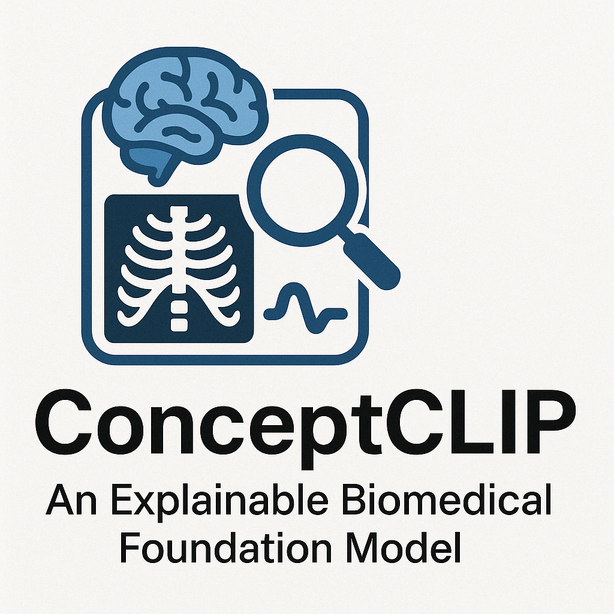

# [Nature Biomedical Engineering 2026] An Explainable Biomedical Foundation Model via Large-Scale Concept-Enhanced Vision-Language Pre-training

<div align="center">
  
</div>

<div align="center">

[](https://www.nature.com/articles/s41551-026-01764-x)
[](https://arxiv.org/abs/2501.15579)
[](https://huggingface.co/JerrryNie/ConceptCLIP)
[](https://huggingface.co/datasets/JerrryNie/MedConcept-23M)
[](https://huggingface.co/datasets/JerrryNie/pmc9k)

</div>

---

**ConceptCLIP** is an explainable biomedical foundation model for vision-language learning, designed to improve both **general-purpose medical image understanding** and **interpretability** through large-scale concept-enhanced pre-training.

It is built on large-scale biomedical image-text-concept supervision and supports a wide range of downstream tasks, including:

- **Medical image diagnosis**
- **Cross-modal retrieval**
- **Visual question answering**
- **Medical report generation**
- **Pathology whole-slide image analysis**
- **Medical concept annotation**
- **Inherently interpretable modeling**

## News

- **2026.** Our paper has been formally published in **Nature Biomedical Engineering**.
- **2025.** ConceptCLIP preprint released on arXiv.
- **2025.** Pretrained model and datasets released on Hugging Face.

## Overview

ConceptCLIP introduces a concept-enhanced biomedical vision-language pre-training framework that explicitly incorporates medical concepts into representation learning. Compared with conventional image-text pre-training, ConceptCLIP improves biomedical generalization and interpretability by leveraging concept-aware supervision at scale.

### Key features

- **Large-scale concept-enhanced pre-training** on biomedical image-text-concept triplets
- **Improved explainability** through concept-based interpretation
- **Broad modality coverage**, including radiology, pathology, and other biomedical images
- **Strong transferability** across diverse downstream biomedical tasks

## Resources

- **Published paper:** https://www.nature.com/articles/s41551-026-01764-x
- **arXiv preprint:** https://arxiv.org/abs/2501.15579
- **Model checkpoint:** https://huggingface.co/JerrryNie/ConceptCLIP
- **Pre-training metadata (MedConcept-23M):** https://huggingface.co/datasets/JerrryNie/MedConcept-23M
- **Retrieval benchmark metadata (PMC-9K):** https://huggingface.co/datasets/JerrryNie/pmc9k


## Quick Start

### Installation

```bash
# Clone the repository
git clone https://github.com/JerrryNie/ConceptCLIP.git
cd ConceptCLIP
```

For model inference, use the supported library versions listed in the [official ConceptCLIP model card](https://huggingface.co/JerrryNie/ConceptCLIP#how-to-get-started-with-the-model). Downstream tasks have additional dependencies; consult their task instructions below. There is no repository-wide `requirements.txt`.

### Access Pre-trained Model from Hugging Face

ConceptCLIP is available on Hugging Face as [`JerrryNie/ConceptCLIP`](https://huggingface.co/JerrryNie/ConceptCLIP).

> **Note**
> The Hugging Face repository uses gated access. Please request access on the model page and authenticate with Hugging Face before loading the model.

### Using Pre-trained Model

```python
from transformers import AutoModel, AutoProcessor
import torch
from PIL import Image

# Load model and processor directly from Hugging Face
model = AutoModel.from_pretrained("JerrryNie/ConceptCLIP", trust_remote_code=True)
processor = AutoProcessor.from_pretrained("JerrryNie/ConceptCLIP", trust_remote_code=True)

# Select device
device = "cuda" if torch.cuda.is_available() else "cpu"
model = model.to(device).eval()

# Prepare inputs
# Replace with an image you have obtained from an authorized source.
image = Image.open("path/to/your/image.jpg").convert("RGB")
labels = ["chest X-ray", "brain MRI", "skin lesion"]
texts = [f"a medical image of {label}" for label in labels]

# Process inputs
inputs = processor(
    images=image,
    text=texts,
    return_tensors="pt",
    padding=True,
    truncation=True
).to(device)

# Get predictions
with torch.no_grad():
    outputs = model(**inputs)
    logits = (
        outputs["logit_scale"]
        * outputs["image_features"]
        @ outputs["text_features"].t()
    ).softmax(dim=-1)[0]

print({label: f"{prob:.2%}" for label, prob in zip(labels, logits)})
```

## Datasets

The repository provides evaluation pipelines for representative public benchmarks used to reproduce or demonstrate different ConceptCLIP capabilities. The table below is **not intended to be an exhaustive list of all datasets evaluated in the paper**.

### Data access and source terms

Please obtain third-party datasets directly from their original providers using the links below. The previous personal OneDrive/SharePoint mirrors have been retired. Public availability does not by itself grant permission to redistribute a dataset, and the license of this code repository does not override any dataset's own terms. Complete any registration, access request, or data-use agreement required by the provider, and cite the original dataset publications.

| Task | Dataset | Original source / access instructions |
|------|---------|---------------------------------------|
| Medical Diagnosis | SIIM-ACR | [Official Kaggle competition](https://www.kaggle.com/competitions/siim-acr-pneumothorax-segmentation). Sign in and follow the competition's data-access rules. |
| Cross-Modal Retrieval | QUILT-1M | [Authors' project page](https://quilt1m.github.io/) and [official access instructions](https://github.com/wisdomikezogwo/quilt1m#data-quilt-1m-restricted-access). Access is restricted and subject to the authors' research-use and redistribution terms. |
| Cross-Modal Retrieval | PMC-9K | [ConceptCLIP benchmark release](https://huggingface.co/datasets/JerrryNie/pmc9k). Request access to the metadata; obtain corresponding source images separately as described below. |
| Visual Question Answering | SLAKE | [Official SLAKE page](https://www.med-vqa.com/slake/). Use the SLAKE 1.0 download options maintained by its authors. |
| Medical Report Generation | IU X-Ray | [NLM Open-i](https://openi.nlm.nih.gov/) and its [official collection/download FAQ](https://openi.nlm.nih.gov/faq). Obtain the Indiana University chest X-ray images and reports from NLM. |
| Pathology WSI Analysis | BRACS-3 | [Official BRACS download page](https://www.bracs.icar.cnr.it/download/). Register and follow the [dataset rules](https://www.bracs.icar.cnr.it/rules/); use the BRACS data for the three-class task. |
| Medical Concept Annotation | Derm7pt | [Official download and access-request page](https://derm.cs.sfu.ca/Download.html). Complete the password request and follow the stated dataset license. |
| Inherently Interpretable Model | WBCAtt | [Authors' annotations and preparation instructions](https://github.com/apple2373/wbcatt/tree/main/submission), together with the [original PBC images](https://data.mendeley.com/datasets/snkd93bnjr/1). Both resources are needed. |

MedConcept-23M and PMC-9K are project metadata releases, not replacement download portals for upstream images. Reconstruct source-linked images from the original providers under their applicable terms.

Official releases may have different layouts, file formats, or versions from the retired prepared archives. Before running a task, prepare local files to match the paths and splits expected by its loader and the supplied metadata. Preserve image identifiers and document preprocessing and dataset versions when comparing results. Downloading and extracting an upstream archive alone may not reproduce the former prepared data. If an official service is temporarily unavailable, retry later or contact its provider; for example, Open-i was displaying a maintenance notice when checked on 2026-09-28.

## Downstream Tasks

### 1. Medical Image Diagnosis

Using the SIIM-ACR pneumothorax dataset (requires one GPU with 24GB memory):

Obtain the images from the official competition. The supplied [training metadata](./downstream_evaluation/medical_image_diagnosis/data/meta/011_SIIM-ACR_CLS_CLIP_Train.json) and [test metadata](./downstream_evaluation/medical_image_diagnosis/data/meta/011_SIIM-ACR_CLS_CLIP_Test.json) reference PNG files under `data/images/011_SIIM-ACR/Processed/train/`, relative to the task directory. If using the original DICOM images, convert them locally to PNG and match the identifiers in each annotation's `image` field. The loader uses PIL and does not read DICOM directly; the repository does not include the original DICOM-to-PNG preprocessing recipe.

```bash
# Prepare images to match the supplied metadata under:
# ./downstream_evaluation/medical_image_diagnosis/data/images/011_SIIM-ACR/Processed/train

# Zero-shot evaluation
cd downstream_evaluation/medical_image_diagnosis
python zero_shot.py

# Linear probing
python linear_probing.py

# Full fine-tuning
./fully_fine_tuning.sh
```

### 2. Cross-Modal Retrieval

ConceptCLIP supports cross-modal retrieval evaluation on both **QUILT-1M** and **PMC-9K**.

#### Option A: QUILT-1M

Using the QUILT-1M dataset (requires one GPU with 24GB memory):

Request access through the authors' official instructions. The supplied [evaluation metadata](./downstream_evaluation/cross_modal_retrieval/data/meta/quilt1m_test.jsonl) uses paths such as `002_Quilt1M/images/<filename>.jpg`, relative to `data/images/`. Match these filenames to your authorized local copy, and check that all evaluation images are present. In [retrieval.py](./downstream_evaluation/cross_modal_retrieval/retrieval.py), `Args.val_data` selects the metadata and `Args.image_dir` sets the image root.

```bash
# Arrange the source images to match the supplied metadata under:
# ./downstream_evaluation/cross_modal_retrieval/data/images/002_Quilt1M/images

cd downstream_evaluation/cross_modal_retrieval
python retrieval.py
```

#### Option B: PMC-9K

PMC-9K is also available as a retrieval benchmark on Hugging Face. Request access on the dataset page and authenticate with Hugging Face before loading its metadata.

```python
from datasets import load_dataset

dataset = load_dataset("JerrryNie/pmc9k")
print(dataset)
```

> **Important**
> The Hugging Face repository mainly provides metadata and benchmark artifacts rather than a ready-to-use, fully reconstructed image-text paired dataset.
>
> To build the complete image-text paired dataset for retrieval evaluation, follow a reconstruction workflow similar to the pre-training data pipeline: use the released metadata to locate or recover the corresponding upstream images, then organize the image-text pairs into the format expected by the evaluation code.

Prepare a JSONL file with `image` and `caption` fields, with each image path relative to your local image root. Set `Args.val_data` and `Args.image_dir` in [retrieval.py](./downstream_evaluation/cross_modal_retrieval/retrieval.py) to your PMC-9K metadata and image root before running the command below; the defaults select QUILT-1M.

```bash
cd downstream_evaluation/cross_modal_retrieval
python retrieval.py
```

### 3. Visual Question Answering

Using the SLAKE dataset (requires one GPU with 24GB memory):

Download SLAKE 1.0 from the authors' page and organize it as expected by [slake.py](./downstream_evaluation/visual_question_answering/slake.py):

```text
downstream_evaluation/visual_question_answering/data/001_Slake1.0/
├── train.json
├── validate.json
├── test.json
└── imgs/
```

Keep the image paths referenced by the annotations intact, or update the path constants in `slake.py` to match your local layout.

```bash
cd downstream_evaluation/visual_question_answering
./train_slake_conceptclip.sh
```

### 4. Other Tasks

For the following tasks, refer to their respective README files for detailed instructions:

- **Medical Report Generation**: [README](./downstream_evaluation/medical_report_generation/README.md)
- **Pathology WSI Analysis**: [README](./downstream_evaluation/pathology_whole_slide_image_analysis/README.md)
- **Medical Concept Annotation**: [README](./downstream_evaluation/medical_concept_annotation/README.md)
- **Interpretable Model**: [README](./downstream_evaluation/inherently_interpretable_model/README.md)

## Pre-training Details

To train ConceptCLIP from scratch (requires 6 nodes × 8 H800 GPUs), first prepare the MedConcept-23M metadata, reconstruct the corresponding source images, and convert the metadata into the format expected by the training pipeline.

### 1. Data Preparation

**Step A: Request access and download MedConcept-23M metadata**

We release the **MedConcept-23M** metadata and associated processed artifacts on Hugging Face. The released metadata is approximately **44.9 GB** and is associated with roughly 23 million biomedical image-text-concept triplets used for ConceptCLIP pre-training.

> **Access note**
> MedConcept-23M uses gated access on Hugging Face. Please request access to [`JerrryNie/MedConcept-23M`](https://huggingface.co/datasets/JerrryNie/MedConcept-23M) and authenticate before downloading.

```bash
# Directory for pre-training data
mkdir -p pre_training/src/pretraining_data

# Install Hugging Face CLI if needed
pip install -U huggingface_hub

# Authenticate if needed
hf auth login

# Download the dataset metadata
hf download \
  --repo-type dataset \
  JerrryNie/MedConcept-23M \
  medconcept_23m.jsonl \
  --local-dir pre_training/src/pretraining_data
```

**Step B: Reconstruct source images**

The released metadata contains references to source images from the **PubMed Central Open Access (PMC-OA)** collection. The upstream images should be downloaded/reconstructed locally rather than assumed to be bundled with the metadata release.

We provide `download_pmc_images.py` to automate this process. The script reads the metadata, fetches the corresponding packages from NCBI/PMC, and extracts the required images.

```bash
# --input: Path to the metadata file downloaded in Step A
# --output: Directory where images will be saved

python pre_training/scripts/download_pmc_images.py \
  --input pre_training/src/pretraining_data/medconcept_23m.jsonl \
  --output pre_training/src/pretraining_images
```

> Depending on network conditions and local storage, reconstructing the full image collection can take substantial time and disk space. Users are responsible for complying with applicable upstream data terms and institutional policies.

**Step C: Minimize Metadata**

To reduce memory overhead during data loading, convert the full metadata into a minimized format that retains the fields required by the training code, such as captions, image paths, and concept indices.

```bash
# Input: The file downloaded in Step A
# Output: pre_training/src/pretraining_data/medconcept_23m_minimized.jsonl

python pre_training/scripts/convert_to_minimized_meta.py \
  --input_path pre_training/src/pretraining_data/medconcept_23m.jsonl \
  --output_dir pre_training/src/pretraining_data
```

### 2. Running Pre-training

Once the data is downloaded/reconstructed and the metadata is minimized, launch the distributed training scripts. Ensure that the scripts point to the correct `_minimized.jsonl` file and local image directory.

```bash
# First stage: global image-text alignment
cd pre_training
scripts/pretraining_first_stage_23M_multinodes_slurm.sh

# Second stage: add region-concept alignment
scripts/pretraining_second_stage_23M_multinodes_slurm.sh
```

> A smaller sample file is available in [`pretraining_meta_file_sample.jsonl`](./pre_training/src/pretraining_sample_data/pretraining_meta_file_sample.jsonl) for testing the pipeline without downloading the full dataset.

## Data Decontamination / Duplication Check

It is critical to check for image overlap between the pre-training data and downstream evaluation datasets when reproducing the experiments or constructing new evaluation splits.

We provide two utility scripts in the `other_scripts/` directory to help perform this check using perceptual hashing (pHash).

### 1. Install Requirements

The scripts require `ImageHash` and `tqdm`.

```bash
pip install ImageHash tqdm
```

### 2. Workflow

The process involves generating hashes for the datasets and then comparing them.

#### Step A: Generate Pre-training Hashes

1. Open `other_scripts/generate_hashes.py`.
2. Edit the **Configuration** section to point to your pre-training data:

    ```python
    META_FILE_PATH = "path/to/medconcept_23m.jsonl"
    IMAGE_ROOT_DIR = "path/to/pretraining_images_folder"
    OUTPUT_HASH_MAP_FILE = "pretraining_hashes.csv"
    ```

3. Run the script:

    ```bash
    python other_scripts/generate_hashes.py
    ```

#### Step B: Generate Evaluation Data Hashes

1. Ensure your evaluation data has a corresponding metadata file in JSONL format (entries must contain an `"image"` key with the relative path).
2. Open `other_scripts/generate_hashes.py` again.
3. Update the **Configuration** section to point to your evaluation data:

    ```python
    META_FILE_PATH = "path/to/evaluation_dataset.jsonl"
    IMAGE_ROOT_DIR = "path/to/evaluation_images_folder"
    OUTPUT_HASH_MAP_FILE = "evaluation_hashes.csv"
    ```

4. Run the script:

    ```bash
    python other_scripts/generate_hashes.py
    ```

#### Step C: Check for Duplicates

Use `other_scripts/check_duplicates.py` to compare the two CSV files generated in the previous steps.

```bash
python other_scripts/check_duplicates.py \
  pretraining_hashes.csv \
  evaluation_hashes.csv \
  --output duplicates_report.csv
```

**Output:**

- The script prints the total number of overlapping images found.
- If duplicates are found, a detailed report is saved to `duplicates_report.csv` (or the file specified by `--output`).
- Each row in the report contains the shared `Hash`, the `Evaluation_Image_Path`, and the corresponding `Pretraining_Image_Path`.

## Responsible Use and Limitations

ConceptCLIP and its project releases are intended for **research, benchmarking, education, and responsible model development**, subject to their applicable terms. Third-party datasets remain subject to their original providers' licenses and access conditions.

- ConceptCLIP is **not a medical device** and should not be used as the sole basis for diagnosis, treatment, triage, or other clinical decisions.
- Benchmark performance does not by itself establish clinical validity. Any real-world use requires task-specific validation, appropriate human oversight, and compliance with local institutional and regulatory requirements.
- Concept-level explanations and region-concept correspondences can improve interpretability, but they do **not** guarantee causal correctness and may still reflect spurious visual correlations or dataset bias.
- Performance may vary across institutions, scanners, acquisition protocols, patient populations, disease prevalence, and imaging modalities.
- When reconstructing source-linked datasets, users are responsible for preserving provenance and complying with applicable upstream terms, licenses, and data-governance requirements.

## Citation

If you find ConceptCLIP useful in your research, please cite the **published Nature Biomedical Engineering paper**. The author order below follows the online journal version.

**Nature-style citation:**

> Nie, Y., He, S., Bie, Y. *et al.* An explainable biomedical foundation model via large-scale concept-enhanced vision-language pre-training. *Nat. Biomed. Eng.* https://doi.org/10.1038/s41551-026-01764-x (2026).

```bibtex
@article{nie2026conceptclip,
  title={An explainable biomedical foundation model via large-scale concept-enhanced vision-language pre-training},
  author={Nie, Yuxiang and He, Sunan and Bie, Yequan and Wang, Yihui and Chen, Zhixuan and Yang, Shu and Cai, Zhiyuan and Wu, Linshan and Wang, Hongmei and Wang, Xi and Cheng, Ngai Shing and Luo, Luyang and Wu, Mingxiang and Jin, Haibo and Wu, Xian and Chan, Ronald Cheong Kin and Lau, Yuk Ming and Zhang, Zhengyu and Xiao, Sushan and Yang, Can and Zhao, Yinghua and Duan, Xiaohui and Zhang, Li and Liang, Li and Zheng, Yefeng and Rajpurkar, Pranav and Chen, Hao},
  journal={Nature Biomedical Engineering},
  year={2026},
  doi={10.1038/s41551-026-01764-x},
  url={https://doi.org/10.1038/s41551-026-01764-x}
}
```

The earlier preprint is available at [arXiv:2501.15579](https://arxiv.org/abs/2501.15579), but please cite the journal version whenever possible.
